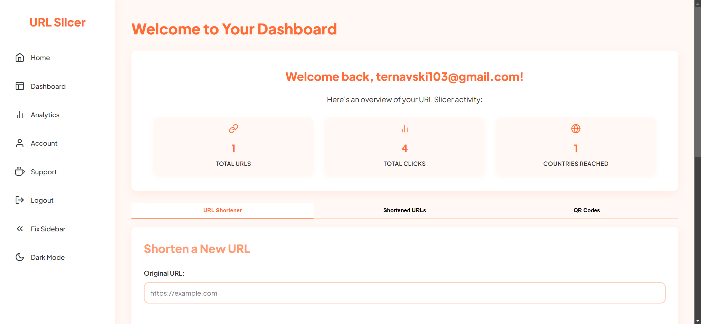

# URL Slicer 🔪

[](https://www.gnu.org/licenses/gpl-3.0)
[](https://nodejs.org)
[](https://expressjs.com)
[](https://www.mongodb.com)
[](https://github.com/LyubomirT/url-slicer/issues)

URL Slicer is an easy-to-use, lightweight web tool for shortening URLs in a modern and customizable way. Slice through the clutter of long URLs and serve your audience with clean, manageable links!



## 🌐 Try URL Slicer out!

You can try out URL Slicer at [url-slicer.obl.ong](https://urlslicer.obl.ong). It's totally free and has absolutely no limits!

## 🚀 Features

- 🔗 Custom short links
- 📊 Detailed analytics
- 🔒 Advanced security options
- 📱 Mobile-friendly design
- 🌍 Geo-targeting
- 🔐 Password protection
- 🖼️ QR code generation

## 🛠️ Technologies Used

- **Backend**: Node.js with Express.js
- **Database**: MongoDB with Mongoose
- **Authentication**: Passport.js
- **Frontend**: EJS templating engine
- **Styling**: Custom CSS
- **Icons**: Feather Icons
- **Email**: Nodemailer (with Outlook SMTP)
- **Geolocation**: geoip-lite
- **QR Code**: qrcode

## 🏗️ Project Structure

```
url-slicer/
│
├── views/                 # EJS templates
├── public/                # Static assets
│   └── styles.css         # Main stylesheet
├── server.js              # Main application file
├── package.json           # Project dependencies
└── .env                   # Environment variables (not in repo)
```

## 🚀 Getting Started

1. Clone the repository:
   ```
   git clone https://github.com/LyubomirT/url-slicer.git
   ```

2. Install dependencies:
   ```
   npm install
   ```

3. Set up your environment variables in a `.env` file:
   ```
   login=your_outlook_email@example.com
   password=your_outlook_password
   PORT=3000
   SESSION_SECRET=your_session_secret
   MongoURI=your_mongodb_connection_string
   ```

4. Start the server:
   ```
   npm start
   ```

5. Visit `http://localhost:3000` in your browser.

## 🔐 Security Features

- Password hashing with bcrypt
- Session management
- CSRF protection
- Rate limiting for password attempts
- Secure password reset mechanism

## 📊 Analytics

URL Slicer provides detailed analytics for your shortened URLs, including:

- Total clicks
- Geographical distribution of clicks
- Device and browser statistics
- Click-through rates over time

## 🌐 API Endpoints

- `/shorten`: Create a new short URL
- `/:code`: Redirect to the original URL
- `/stats/:code`: Get statistics for a specific URL
- `/api/analytics`: Get overall analytics data

## 🤝 Contributing

Contributions, issues, and feature requests are welcome! Feel free to check [issues page](https://github.com/LyubomirT/url-slicer/issues).

## 📜 License

This project is [GPL-3.0](https://www.gnu.org/licenses/gpl-3.0.en.html) licensed.

## 👤 Author

**Lyubomir Ternavskiy**

- GitHub: [@LyubomirT](https://github.com/LyubomirT)
- Buy Me a Coffee: [Support URL Slicer](https://www.buymeacoffee.com/lyubomirt)
- Discord: @lyubomirt
- Email: [ternavski103@gmail.com](mailto:ternavski103@gmail.com)
- Server: [The Orange Squad](https://discord.gg/the-orange-squad)

---

<p align="center">
  Made with ❤️ by <a href="https://github.com/LyubomirT">Lyubomir Ternavskiy</a>
</p>
